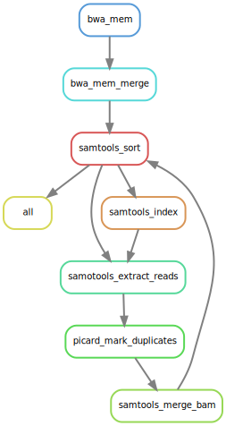

# :snake: hydra-genetics/alignment

Snakemake module containing processing steps that should be performed during sequence alignment.


[](https://opensource.org/licenses/gpl-3.0.html)

## :speech_balloon: Introduction

The module consists of alignment processing steps, such as alignment of `.fastq`-files. and duplicates marking
`.bam`-files.

## :heavy_exclamation_mark: Dependencies

In order to use this module, the following dependencies are required:

[](https://github.com/hydra-genetics/)
[](https://pandas.pydata.org/)
[](https://www.python.org/)
[](https://snakemake.readthedocs.io/en/stable/)
[](https://sylabs.io/docs/)

## :school_satchel: Preparations

### Sample and unit data

Input data should be added to [`samples.tsv`](https://github.com/hydra-genetics/prealignment/blob/develop/config/samples.tsv)
and [`units.tsv`](https://github.com/hydra-genetics/prealignment/blob/develop/config/units.tsv).
The following information need to be added to these files:

| Column Id | Description |
| --- | --- |
| **`samples.tsv`** |
| sample | unique sample/patient id, one per row |
| **`units.tsv`** |
| sample | same sample/patient id as in `samples.tsv` |
| type | data type identifier (one letter), can be one of **T**umor, **N**ormal, **R**NA |
| platform | type of sequencing platform, e.g. `NovaSeq` |
| machine | specific machine id, e.g. NovaSeq instruments have `@Axxxxx` |
| flowcell | identifer of flowcell used |
| lane | flowcell lane number |
| barcode | sequence library barcode/index, connect forward and reverse indices by `+`, e.g. `ATGC+ATGC` |
| fastq1/2 | absolute path to forward and reverse reads |
| adapter | adapter sequences to be trimmed, separated by comma |

### Reference data

You need have a indexed reference genome, with the following files:
- reference.fna
- reference.dict
- reference.fna.amb
- reference.fna.ann
- reference.fna.bwt
- reference.fna.fai
- reference.fna.pac
- reference.fna.sa


## :white_check_mark: Testing

The workflow repository contains a small test dataset `.tests/integration` which can be run like so:

```bash
$ cd .tests/integration
$ snakemake -s ../../Snakefile -j1 --use-singularity
```

## :rocket: Usage

To use this module in your workflow, follow the description in the
[snakemake docs](https://snakemake.readthedocs.io/en/stable/snakefiles/modularization.html#modules).
Add the module to your `Snakefile` like so:

```bash
module alignment:
    snakefile:
        github(
            "hydra-genetics/alignment",
            path="workflow/Snakefile",
            tag="1.0.0",
        )
    config:
        config


use rule * from alignment as alignment_*
```

### Input files

| File | Description |
|---|---|
| ***`hydra-genetics/prealignment data`*** |
| `prealignment/fastp_pe/{sample}_{flowcell}_{lane}_{type}_fastq1.fastq.gz` | Merged and possibly trimmed foward reads |
| `prealignment/fastp_pe/{sample}_{flowcell}_{lane}_{type}_fastq1.fastq.gz` | Merged and possibly trimmed reverse reads |
| ***`original fastq files`*** |
| `PATH/fastq1.fastq.gz` | forward reads retrieved from units.tsv |
| `PATH/fastq2.fastq.gz` | reverse reads retrieved from units.tsv |


### Output files

The following output files should be targeted via another rule:

| File | Description |
|---|---|
| `alignment/bwa_mem/{sample}_{type}.bam` | Aligned data |
| `alignment/samtools_extract_reads/{sample}_{type}_{chr}.bam` | Aligned data separated by chromosome |
| `alignment/samtools_merge_bam/{sample}_{type}.bam` | Aligned data which have been duplicate marked |

## :judge: Rule Graph

### Align and mark duplicates


