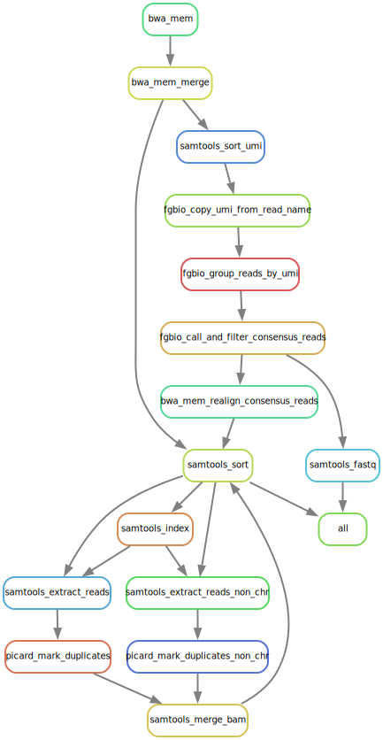

#  hydra-genetics/alignment

Snakemake module containing processing steps that should be performed during sequence alignment.


[](https://opensource.org/licenses/gpl-3.0.html)

## :speech_balloon: Introduction

The module consists of alignment processing steps, such as alignment of `.fastq`-files. and duplicates marking
`.bam`-files.

## :heavy_exclamation_mark: Dependencies

In order to use this module, the following dependencies are required:

[](https://github.com/hydra-genetics/)
[](https://pandas.pydata.org/)
[](https://www.python.org/)
[](https://snakemake.readthedocs.io/en/stable/)
[](https://sylabs.io/docs/)
[](https://pypi.org/project/drmaa/)
[](https://pypi.org/project/tabulate/)

**Note! Releases of prealignment <= v0.4.0 needs tabulate<0.9.0 added in requirements.txt**

## :school_satchel: Preparations

### Sample and unit data

Input data should be added to [`samples.tsv`](https://github.com/hydra-genetics/prealignment/blob/develop/config/samples.tsv)
and [`units.tsv`](https://github.com/hydra-genetics/prealignment/blob/develop/config/units.tsv).
The following information need to be added to these files:

| Column Id | Description |
| --- | --- |
| **`samples.tsv`** |
| sample | unique sample/patient id, one per row |
| **`units.tsv`** |
| sample | same sample/patient id as in `samples.tsv` |
| type | data type identifier (one letter), can be one of **T**umor, **N**ormal, **R**NA |
| platform | type of sequencing platform, e.g. `NovaSeq` |
| machine | specific machine id, e.g. NovaSeq instruments have `@Axxxxx` |
| flowcell | identifier of flowcell used |
| lane | flowcell lane number |
| barcode | sequence library barcode/index, connect forward and reverse indices by `+`, e.g. `ATGC+ATGC` |
| fastq1/2 | absolute path to forward and reverse reads |
| adapter | adapter sequences to be trimmed, separated by comma |

### Reference data

You need have a indexed reference genome: e.g. `reference.fna`

For bwa the files are generated by [bwa index](http://bio-bwa.sourceforge.net/bwa.shtml#:~:text=SYNOPSIS-,bwa%20index%20ref.fa,-bwa%20mem%20ref). Dict files is generated using `picard CreateSequenceDictionary`. fai is generated using `samtools index`
| File | Description | Generated by | 
| -----| ----------- |------------- |
| reference.dict | dictionary file| `picard CreateSequenceDictionary` | 
| reference.fna.amb | record appearance of N (or other non-ATGC) in the ref fasta | `bwa index` |
| reference.fna.ann | record ref sequences, name, length, etc |  `bwa index` |
| reference.fna.bwt | the Burrows-Wheeler transformed sequence |  `bwa index` |
| reference.fna.fai | index file| `samtools index` |
| reference.fna.pac | packaged sequence (four base pairs encode one byte) | `bwa index` |
| reference.fna.sa | suffix array index | `bwa index`|

For the RNA-aligner [Star](https://github.com/alexdobin/STAR) a star index is needed. This can be generated based on the reference genome. Example command:
```bash
STAR --runThreadN 8 --runMode genomeGenerate --genomeDir star_index --genomeFastaFiles reference.fna
```

## :white_check_mark: Testing

The workflow repository contains a small test dataset `.tests/integration` which can be run like so:

```bash
$ cd .tests/integration
$ snakemake -s ../../Snakefile -j1 --configfile config.yaml --use-singularity
```

## :rocket: Usage

To use this module in your workflow, follow the description in the
[snakemake docs](https://snakemake.readthedocs.io/en/stable/snakefiles/modularization.html#modules).
Add the module to your `Snakefile` like so:

```bash
module alignment:
    snakefile:
        github(
            "hydra-genetics/alignment",
            path="workflow/Snakefile",
            tag="v0.4.0",
        )
    config:
        config


use rule * from alignment as alignment_*
```

### Compatibility

Latest:
 - prealignment:v1.1.0

 See [COMPATIBLITY.md](../master/COMPATIBLITY.md) file for a complete list of module compatibility.

### Input files

| File | Description |
|---|---|
| ***`hydra-genetics/prealignment data`*** |
| `prealignment/fastp_pe/{sample}_{type}_{flowcell}_{lane}_fastq1.fastq.gz` | trimmed forward reads |
| `prealignment/fastp_pe/{sample}_{type}_{flowcell}_{lane}_fastq2.fastq.gz` | trimmed reverse reads |
| ***`original fastq files`*** |
| `PATH/fastq1.fastq.gz` | forward reads retrieved from units.tsv |
| `PATH/fastq2.fastq.gz` | reverse reads retrieved from units.tsv |


### Output files

The following output files should be targeted via another rule:

| File | Description |
|---|---|
| `alignment/samtools_merge_bam/{sample}_{type}.bam` | aligned data which have been duplicate marked |
| `alignment/star/{sample}_{type}.bam` | aligned rna data |

## :judge: Rule Graph

### Align and mark duplicates


### RNA Alignment

