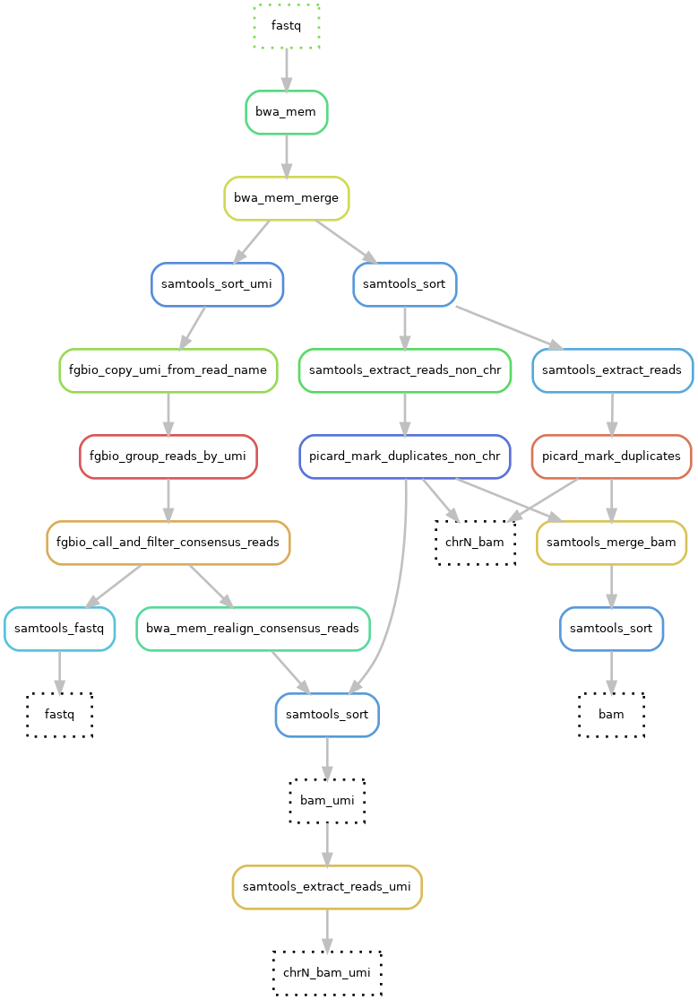
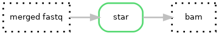

# Hydra-genetics alignment module
The alignment module consists of alignment steps, such as alignment against a reference genome and duplicate filtering. The module takes `.fastq`-files as input and outputs `.bam`-files. BWA-mem is used to align DNA data while STAR is used for RNA data. Picard is used for duplicate marking and samtools for merging, sorting, and indexing `.bam`-files.

## DNA steps

## RNA steps

{: style="height:22%;width:22%"}

## Module input files
Trimmed or untrimmed merged `.fastq`-files.

* `prealignment/merged/{sample}_{type}_{read}.fastq.gz`

## Module output files
Aligned, merged and sorted `.bam`-files as well as chromosome split `.bam`-files for speeding up downstream analysis.

* `alignment/samtools_merge_bam/{sample}_{type}.bam`
* `alignment/picard_mark_duplicates/{sample}_{type}_{chr}.bam`
* `alignment/star/{sample}_{type}.bam`
* `alignment/star/{sample}_{type}.SJ.out.tab`
