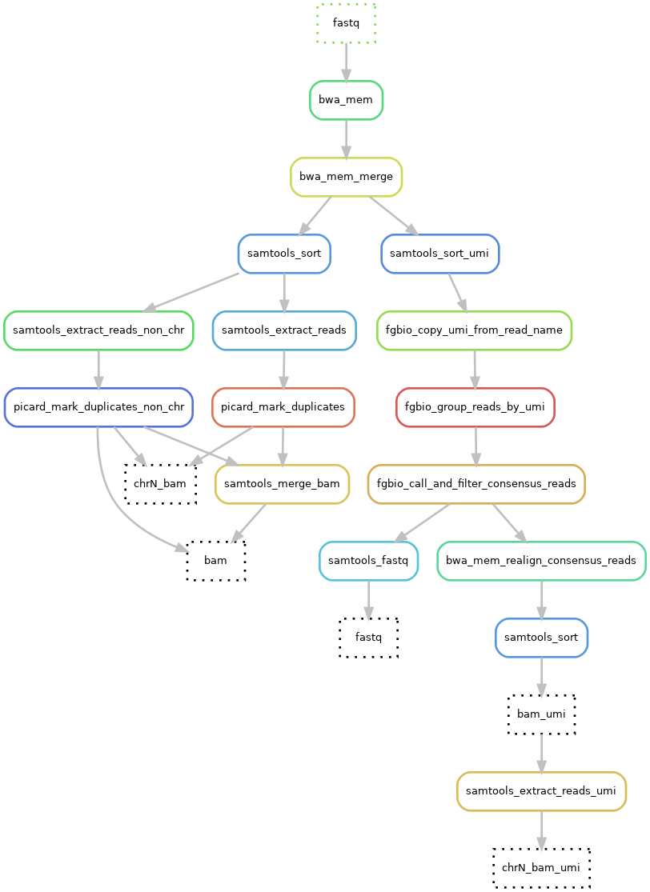
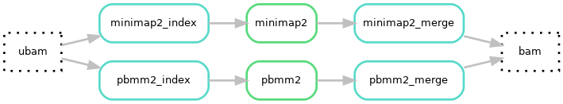

# Hydra-genetics alignment module
The alignment module consists of alignment steps, such as alignment against a reference genome and duplicate filtering. The module takes `.fastq` files as input and outputs `.bam` files. BWA-mem is used to align short read DNA data while Minimap2 or Pbmm2 can be used to long read DNA data. For RNA short read data STAR is used as aligner. Picard is used for duplicate marking and samtools for merging, sorting, and indexing `.bam` files. When UMI barcodes are used consensus reads are created using fgbio in combination with BWA-mem.

## DNA short read steps

## DNA long read steps

## RNA steps

{: style="height:22%;width:22%"}

## Module input files for short read data
Trimmed or untrimmed merged `.fastq` files.

* `prealignment/merged/{sample}_{type}_{read}.fastq.gz`

## Module input files for long read data
Unmapped `.bam` files specified in the units.tsv under the bam column.

## Module output files
Aligned, merged and sorted `.bam` files as well as chromosome split `.bam` files for speeding up downstream analysis. UMI-consensus-files get a umi tag added to the bam-filename.

* `alignment/samtools_merge_bam/{sample}_{type}.bam`
* `alignment/picard_mark_duplicates/{sample}_{type}_{chr}.bam`
* `alignment/bwa_mem_realign_consensus_reads/{sample}_{type}_{chr}.umi.bam`
* `alignment/samtools_extract_reads_umi/{sample}_{type}_{chr}.umi.bam`
* `alignment/star/{sample}_{type}.bam`
* `alignment/star/{sample}_{type}.SJ.out.tab`
* `alignment/minimap2_align/{sample}_{type}.bam`
* `alignment/pbmm2_align/{sample}_{type}.bam`
